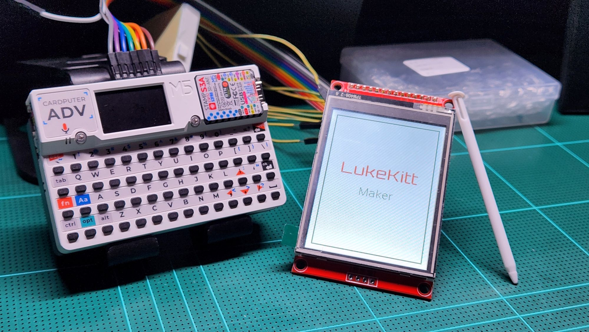
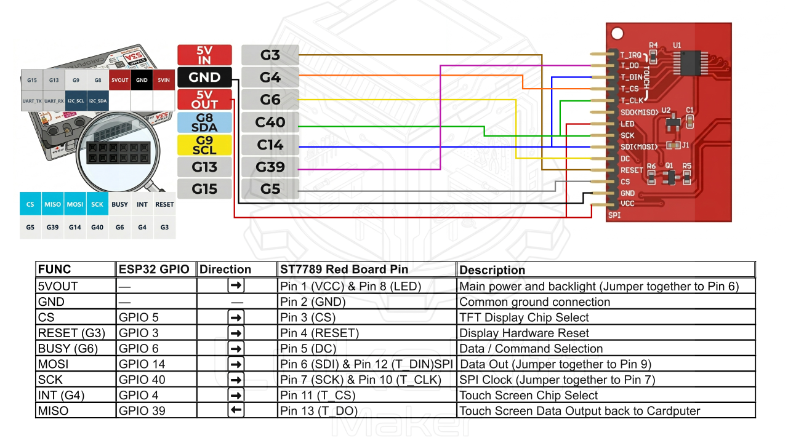

# Cardputer ST7789 Display Module Examples

A comprehensive guide, wiring diagram, and source code for connecting a standard **ST7789 (Red Board) SPI Display with Touch** to an **M5Stack Cardputer**. Featuring custom touch drag-and-drop mechanics built using raw coding and Antigravity AI.

## ✨ Features
- **Raw Command RGB Test:** Verifies screen connectivity and color output using primitive commands.
- **Custom Logo Rendering:** Displays the Lukekitt Maker logo seamlessly in vertical orientation.
- **Smooth Touch Interaction:** Implements drag-and-drop mechanics to move the logo around the screen dynamically.
- **Low-Level Hardware Control:** Bypasses problematic 3rd-party libraries by utilizing raw coding (direct register/SPI control) to prevent system crashes and ensure maximum performance.
- **AI-Assisted Development:** Developed in collaboration with Antigravity AI to optimize workflow and tackle hardware limitations.

## Hardware Wiring

The code is pre-configured to use the following wiring between the Cardputer and the ST7789 module:

| ST7789 Pin | Cardputer Port | ESP32 GPIO | Description |
| :--- | :--- | :--- | :--- |
| **VCC** (1) & **LED** (8) | 5VOUT | - | Main power & backlight |
| **GND** (2) | GND | - | Ground |
| **CS** (3) | G5 | GPIO 5 | TFT Chip Select |
| **RESET** (4) | G3 | GPIO 3 | TFT Reset |
| **DC** (5) | G6 | GPIO 6 | Data/Command |
| **SDI/MOSI** (6) & **T_DIN** (12) | G14 | GPIO 14 | SPI MOSI (Shared) |
| **SCK** (7) & **T_CLK** (10) | G40 | GPIO 40 | SPI Clock (Shared) |
| **T_CS** (11) | G4 | GPIO 4 | Touch Chip Select |
| **T_DO** (13) | G39 | GPIO 39 | Touch Data Out (MISO) |

## Examples Available

Inside the `examples` folder, you will find ready-to-run projects.

### 1. Basic RGB Loop (`examples/01_Basic_RGB_Loop/`)
A bare-minimum, zero-dependency example that uses raw SPI commands to initialize the ST7789 screen and cycles through solid colors (Red, Green, Blue, White). Great for testing if your basic screen wiring is correct.

### 2. Touch and Drag Text (`examples/02_Touch_Drag_Text/`)
An advanced example utilizing the powerful **M5GFX** library for graphics and double-buffered sprites to eliminate flickering. It also implements a raw SPI reader for the XPT2046 touch controller to allow you to drag text around the screen with your finger.

> **Note:** This example requires the `M5GFX` library. Ensure it is installed via the Arduino Library Manager or added to your `platformio.ini` dependencies.

## How to Run

### Using PlatformIO (VSCode)
1. Copy the contents of the `.ino` file from the example you want to run.
2. Paste it into your `src/main.cpp` file.
3. Click **Upload** to flash the code to your Cardputer.
